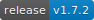

# DNN Azure Active Directory B2C provider
[](https://github.com/intelequia/dnn.azureadb2cprovider/releases) [](https://intelequia.visualstudio.com/DNN%20Azure%20AD%20B2C/_build/latest?definitionId=27&branchName=master)

## Contents
- [DNN Azure Active Directory B2C provider](#dnn-azure-active-directory-b2c-provider)
  - [Contents](#contents)
  - [Requirements](#requirements)
  - [Overview](#overview)
  - [Features](#features)
  - [Installation and configuration guide](#installation-and-configuration-guide)
    - [Step 1: Azure Active Directory B2C setup](#step-1-azure-active-directory-b2c-setup)
    - [Step 2: How to setup the Azure Active Directory application to support role and profile synchronization](#step-2-how-to-setup-the-azure-active-directory-application-to-support-role-and-profile-synchronization)
    - [Step 3: DNN provider installation and configuration](#step-3-dnn-provider-installation-and-configuration)
    - [Step 4. (Optional) Setup the User Management module](#step-4-optional-setup-the-user-management-module)
- [Samples](#samples)
- [Building the solution](#building-the-solution)
  - [Requirements](#requirements-1)
  - [Install package dependencies](#install-package-dependencies)
  - [Debug the client side app](#debug-the-client-side-app)
  - [Build the module](#build-the-module)
- [Additional information](#additional-information)
- [Questions & Issues](#questions--issues)

<a name="requirements"></a>
## Requirements
* **DNN Platform 9.3.0 or later**. Module version 1.4.3 supports DNN 9.3.0+.  Module version 1.4.4-1.5.1 requires DNN 9.4.3+.  Module version 1.6+ requires DNN 9.11+.
* **The website must have installed a SSL certificate because Azure AD B2C requires https urls**. If you need a free one, check [Let's Encrypt](https://letsencrypt.org/)

<a name="overview"></a>
## Overview
The DNN Azure Active Directory B2C Provider is an Authentication provider for DNN Platform, which uses [Azure Active Directory B2C](https://azure.microsoft.com/en-us/services/active-directory-b2c) authentication to authorize users.


This provider can also retrieve all personal information stored in the user attributes in Azure B2C, so that the DNN account is synchronized with that data. All that information is sent as claims during the login process.

<a name="features"></a>
## Features
* Provides DNN Platform - Azure AD B2C integration by portal, so each portal on a DNN installation can setup their own Auth settings, or by the full DNN install, so all the portals share the same B2C tenant
* Allows auto-redirection, so users are automatically redirected to the Azure AD B2C login without seeing the DNN login page
* Supports the following policies (user flows):
  * Sign up/Sign in: users can register on Azure AD B2C and then login, or just login
  * Profile: users can update their user profile when clicking on the DNN user profile link
  * Reset password: users can initiate the reset password flow by clicking on the "forgot password" link available on the login screen
* When a user logins on Azure AD B2C, the B2C profile and roles are synchronized with DNN profile and DNN roles. If a role doesn't exist, is created in the process
* Supports User profile picture synchronization as part of the profile synchronization
* Supports JWT authorization. If enabled, developers can get a JWT auth token directly from Azure B2C login using the "Resource Owner" policy, and then use that token to call any DNN WebAPI Controller with the Auth scheme "JWT".
* Supports for 3rd party WebAPI integration through API Resource and scopes implementation
* New support for custom claim mappings: user mappings, user profile mappings and role mappings.
* New user management module allows to manage Azure AD B2C users directly from the DNN interface, including the force password reset attribute (check "Samples/CustomPolicies/SignInWithForcePasswordReset").
* Now the user and role prefix can be disabled, so user and role names are more friendly (works really well when using "emails" claim as "Id" on the User mappings).

<a name="installation-and-configuration-guide"></a>
## Installation and configuration guide
To setup the provider, you need to complete three steps:
1. How to setup Azure Active Directory B2C
2. How to setup the Azure Active Directory application to support role and profile synchronization
3. How to install the authorization provider in our DNN deployment and how to setup the AD B2C parameters we created before

Following this two steps, you will give access to all your Azure AD B2C users to register and sign-in into your DNN application.

<a name="AADB2C-setup"></a>
### Step 1: Azure Active Directory B2C setup
The following are links to official Microsoft documentation for configuring your Azure AD B2C tenant. Once you have completed all these steps, your B2C tenant will be ready to work with your DNN site:
1. [Create an Azure Active Directory B2C tenant](https://docs.microsoft.com/en-us/azure/active-directory-b2c/tutorial-create-tenant)
2. [Register an application in Azure Active Directory B2C](https://docs.microsoft.com/en-us/azure/active-directory-b2c/tutorial-register-applications)  
   Define the following return urls for your site (i.e https://mysite.com):
   - .../login (and localized urls, e.g. ../en-us/login)
   - .../userprofile (and localized urls, e.g. ../en-us/userprofile)
3. [Create user flows in Azure Active Directory B2C](https://docs.microsoft.com/en-us/azure/active-directory-b2c/tutorial-create-user-flows). For the time being only the following user flows are supported:
   - [Sign-up and sign-in user flow](https://docs.microsoft.com/en-us/azure/active-directory-b2c/tutorial-create-user-flows#create-a-sign-up-and-sign-in-user-flow)
   - [Password reset user flow](https://docs.microsoft.com/en-us/azure/active-directory-b2c/tutorial-create-user-flows#create-a-password-reset-user-flow)
   - [Profile editing user flow](https://docs.microsoft.com/en-us/azure/active-directory-b2c/tutorial-create-user-flows#create-a-profile-editing-user-flow)
4. Optional: [Add identity providers to your applications in Azure Active Directory B2C](https://docs.microsoft.com/en-us/azure/active-directory-b2c/tutorial-add-identity-providers)

**IMPORTANT**: when creating the policies (user flows), ensure the following claims are returned: "given_name", "family_name", "emails", "sub". If not specified, an authorization error will occur when redirected back to the DNN site after login.
To do that, on Azure Portal, go to your B2C Directory then click User flows (policies) on the left menu and select your policy. Then click on **Application claims** and make sure that **Given Name**, **Surname**, **Email Addresses** and **User's Object ID** are checked.


<a name="AAD-setup"></a>
### Step 2: How to setup the Azure Active Directory application to support role and profile synchronization
To support the role and profile synchronization by internally using the Microsoft Graph API, a service principal is needed to call the API. To setup the service principal:

1. Go to https://portal.azure.com to setup the required applications on your Azure Active Directory. You need to use the user credentials of a user with at least "Service Admin" role. Note that this application is different from the one created previously on the B2C section, is a regular application on the Azure AD, not a B2C application.
2. In the left-hand navigation pane, click the Azure Active Directory service, click **App registrations (Legacy)**, and click **New application registration**.
3. When the **Create** page appears, enter your application's registration information:
    * **Name**: Enter a meaningful application name. This can be any name you want and is simply how you will identify the application in your Azure Active Directory (i.e. "My DNN MS Graph Application").
    * **Application type**: Select "Web app / API" (notice that Web Applications and Web API’s are considered the same type of application as far as Azure AD is concerned)
    * **Sign-On URL**: This is the URL where user can sign in and use your app. In a typical DNN site, this should be something like "http://mysite.com/Login". You can change this URL later.
4. <a name="applicationid"></a> When finished, click **Create**. Azure AD assigns a unique **Application ID** to your application, and you're taken to your application's main registration page.
5. Click on the name of the app we've just created and then on "All settings" > "API permissions" > "Microsoft Graph". Ensure that the app has, at least the following API Permissions over the MS Graph API:
    * Delegated
        * offline_access
        * openid    
    * Application
        * Application.Read.All
        * Group.Read.All
        * GroupMember.Read.All
        * User.Read.All   
        
   If you want to use the User Management module, to manage B2C users from the DNN UI, you should also setup these other permissions:
    * Application
        * Group.ReadWrite.All
        * GroupMember.ReadWrite.All
        * User.ReadWrite.All

6. Click on the **Grant permissions** button and then click on "Yes" to grant the permissions in all the accounts in the current directory.
7. <a name="getaadkey"></a> Now on the **Settings** page, under the **keys** section, create a new key with the desired expiration. Click on Save and then copy the key to a secure location. `IMPORTANT: you won't be able to copy this key later, so copy it now or generate a new one when needed.`
8. To support resetting passwords for users thought the User Management module, this application needs permissions to manage the users' passwords. To allow that, on the Azure Portal go to Azure Active Directory > Roles and administrators > Click on 'User administrator' > click on '+ Add assignment' to add your Application ID.

<a name="provider-configuration"></a>
### Step 3: DNN provider installation and configuration
It's important to remember that, if you want to use this module, you need a DNN deployment with  **version 9.3.0 or later**. 

1. Download the DNN Azure AD provider from the Releases folder (i.e. AzureAdB2CProvider_01.00.00_Install.zip) https://github.com/intelequia/dnn.azureadb2cprovider/releases
2. Login into your DNN Platform website as a host user and install the provider from the `Host > Extensions` page
3. Use the **Install Extension Wizard** to upload and install the file you downloaded in step 1. Once installed, you can setup the provider from the new settings page, under the section **Azure AD B2C** in the Persona Bar:


The settings page is divided into general and advanced settings. 
1. GENERAL SETTINGS

To start, you can simply fill up the general settings:
* **Enabled**: Use this switch to enable/disable the Azure AD B2C provider
* **Auto-Redirect**: This option allows you to automatically redirect your login page to the Azure AD B2C login page. If for some reason you need to login with the legacy DNN auth (i.e. using a host user), you can pass the "legacy=1" parameter in your login URL (i.e. https://mysite.com/login?legacy=1)
* **Use Global Settings**: If enabled, all the settings are applied to all portals on this deployment. Only Super Users can edit this setting
* **Tenant Name**: This is the name of your tenant. It's the name that's in your domain name, but without the ".onmicrosoft.com" part. For instance, if your domain name is _test123.onmicrosoft.com_, your tenant name is _test123_. If you are using Azure AD B2C with a custom domain, type your custom domain instead (i.e. login.mydomain.com)
* **Tenant ID**: You can get this parameter from the **Properties** section of your Azure Active Directory (it's the value of the field **Directory ID**)
* **App ID**: This is the **Application ID** of the application you created in [step 1](#AADB2C-setup) of the previous section of this guide (the B2C application)
* **Secret**: This is the **Key** that you generated when you created the application in [step 1](#AADB2C-setup) of the previous section
* **Redirect Uri**: If specified, the redirect uri after a successful login. By default (blank), the user will be redirected to the page originating the login redirection. This is specially useful on multiportal scenario (different DNN portals sharing the same B2C tenant), by specifying the URL https://mysite.com/api/DotNetNuke.Authentication.Azure.B2C.Services/Authorization/RedirectToPortal. This endpoints automatically manages the redirection after a successfull login, so you only need to specify this redirection URL on the B2C application and the user ends in the right portal after the login.
* Policies (user flows):
  * **Sign up and/or sign in**: The name of your Sign-up or Sign-in policy that you created before (depending on if you want to support user registration or not)
  * **Profile**: The name of your profile policy that you created before
  * **Reset the password**: The name of the policy that you created before to reset the password


2. ADVANCED SETTINGS

For advanced scenarios, check the advanced settings:
* Synchronization:
  * **Role Sync**: enables the role sync after user signin, and let the DNN scheduler task to sync all the B2C roles, every 3 hours by default (this can affect login performance)
  * **Profile Sync**: enables profile sync after user sigin, including the profile picture (this can affect login performance)
  * **Application Id**: the application ID of the application created in [step 2](#AAD-setup) of the previous section of this guide (the Azure AD application, not the B2C)
  * **Application Key**: the secret of the application mentioned above
* Name prefixes:
  * **Prefix user names**: Enables the addition of the prefix "AzureB2C-" to all user names coming from B2C.
  * **Prefix group names**: Enables the addition of the prefix "AzureB2C-" to all group names coming from B2C.
* JWT Authorization:
  * **Enable JWT authorization**: enables the possibility of using JWT tokens created by directly using the Azure AD B2C API, and then call a DNN WebAPI controller decorated with the attribute `[DnnAuthorize(AuthTypes = "JWT")]`. An example of this controller, can be found in `DotNetNuke.Authentication.Azure.B2C\Services\HelloController.cs`. See "Hello" sample for more information.
  * **Audiences**: audiences, separated by commas, to validate on a JWT token when JWT authorization is used. If the field is empty, by default the B2C application Id is used as default audience.
* API Resource. If you are going to use the issued tokens to access an external WebAPI that uses B2C authorization, you can specify the App ID URI and scopes that wil be validated by that WebAPI
  * **App ID Uri**: The App ID Uri of the external WebAPI, obtained from the Azure portal (i.e. https://mytenant.onmicrosoft.com/myapi/)
  * **Scopes**: The scopes separated by spaces, that will be include in the issued tokens, to be validated by the external WebAPI (i.e. "read write")


3. MAPPINGS

In this section you can customize the claim mappings between Azure AD B2C claims and DNN properties and attributes:
* **User mappings**: maps B2C claims to DNN user properties. These properties are fixed and are mandatory, with the exception of the "portalId" claim that can be left without mapping. By default, the "Id" property (the username) is mapped with the "sub" claim (a guid). If you are using emails as usernames, you can map the "emails" claim and disable the "Prefix user names" option in the advanced settings.
* **User profile mappings**: maps B2C claims to DNN user profile properties. You can add or remove mappings as desired.
* **Role mappings**: maps B2C roles with DNN roles by name. By default, this list is empty, so all B2C roles are synced with DNN. If there are one or more mappings, only the B2C roles on the list will be synced.


<a name="step-4-setup-user-management-module"></a>
### Step 4. (Optional) Setup the User Management module
If you want to manage the B2C users directly from the DNN portal, with operations such as creating/modifying/deleting users, changing their B2C roles, or even forcing the password reset, you can use the new Azure AD B2C User Management module. **The module needs that the Microsoft Graph Advanced settings have been setup**:
* Create a page and call it "User Management"
* Drop the "DNN Azure Active Directory B2C User Management" module to the page


If everything is setup correctly, the current list of users appears, allowing to add new ones. Note that if the "portalId" claim mapping (user mappings tab) is specified, the list of users will be filtered by the current portal Id.


<a name="samples"></a>
# Samples
Under the "samples" directory, you will find some samples that will show some integration scenarios, like integration mobile apps with DNN by using Azure AD B2C JWT auth tokens:
* [samples/hello](samples/Hello): a simple console App, that allows you to login with a username and password into Azure AD B2C, and then call a DNN WebAPI controller
* [samples/active-directory-b2c-dotnet-webapp-and-webapi](samples/active-directory-b2c-dotnet-webapp-and-webapi): slight modified version of the sample available on the Microsoft Azure B2C repo samples, with a webapp and a webapi consuming Azure AD B2C. Modification to setup CORS, to allow the DNN module example work with the webapi.
* [samples/SPA-WebAPI-Client](samples/SPA-WebAPI-Client): a To-do list DNN module example, that calls an external WebAPI by using B2C JWT tokens. 
* [samples/CustomPolicies](samples/CustomPolicies): custom policies samples to expand the built-in functionalities of Azure AD B2C (i.e. force password reset policy).
* [samples/ChromeExtension](samples/ChromeExtension): Chrome Extension that can be used as example template demostrating how to consume an external WebAPI secured with Azure AD B2C.

For more samples, check:
* [Microsoft Azure AD B2C samples](https://docs.microsoft.com/en-us/azure/active-directory-b2c/code-samples): check different samples from Microsoft, including Mobile and Desktop apps, WebAPI, Web apps, and single page applications.
* [Advanced Azure B2C samples, policies and other stuff](https://github.com/azure-ad-b2c/samples)

<a name="building"></a>
# Building the solution
### Requirements
* Visual Studio 2022 (download from https://www.visualstudio.com/downloads/)
* npm package manager (download from https://www.npmjs.com/get-npm)

### Install package dependencies
From the command line, enter the `<RepoRoot>\DotNetNuke.Authentication.Azure.B2C\AzureADB2C.Web` and run the following commands:
```
  npm install -g webpack
  npm install -g webpack-cli
  npm install -g webpack-dev-server --force
  npm install --force
```

### Debug the client side app
To debug the client side, build the module in debug mode and copy the .dll and .pdb files into your site /bin folder (you can tweak the post build event for such purpose). That will try to load the persona bar bundle script from https://localhost:8080. 

The second step is to start the local webpack dev server. To do it, 
From the command line, enter the `<RepoRoot>\DotNetNuke.Authentication.Azure\AzureADB2C.Web` and run the following commands:
```
  webpack-dev-server
```

### Build the module
Now you can build the solution by opening the file `DotNetNuke.Authentication.Azure.B2C.sln` in Visual Studio. Building the solution in "Release", will generate the React bundle and package it all together with the installation zip file, created under the "\releases" folder.

## Additional information

Additional information regarding this sample can be found in Microsoft documentation:
* [Azure Active Directory B2C Documentation](https://docs.microsoft.com/en-us/azure/active-directory-b2c)
* [How to build a .NET web app using Azure AD B2C](https://docs.microsoft.com/azure/active-directory-b2c/active-directory-b2c-devquickstarts-web-dotnet-susi)
* [How to build a .NET web API secured using Azure AD B2C](https://docs.microsoft.com/azure/active-directory-b2c/active-directory-b2c-devquickstarts-api-dotnet)
* [How to call a .NET web api using a .NET web app](https://docs.microsoft.com/azure/active-directory-b2c/active-directory-b2c-devquickstarts-web-api-dotnet)
* [Get started with custom policies in Azure Active Directory B2C](https://docs.microsoft.com/en-us/azure/active-directory-b2c/active-directory-b2c-get-started-custom?tabs=applications)
* [Solutions and Training for Azure Active Directory B2C](https://docs.microsoft.com/en-us/azure/active-directory-b2c/solution-articles)
* [Tips and tricks for working with custom policies in Azure AD B2C by @rbrayb](https://medium.com/the-new-control-plane/tips-and-tricks-for-working-with-custom-policies-in-azure-ad-b2c-eb63b508a075)

## Questions & Issues

Please file any questions or problems with the sample as a github issue. You can also post on [StackOverflow](https://stackoverflow.com/questions/tagged/azure-ad-b2c) with the tag `azure-ad-b2c`.
