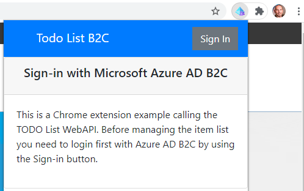
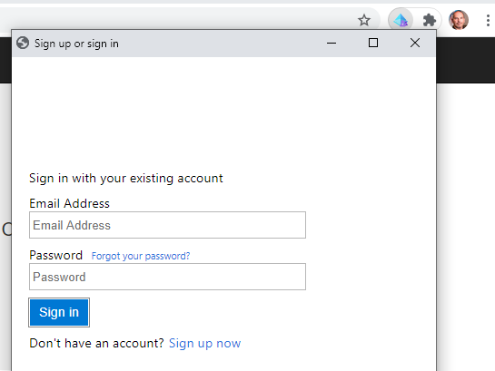
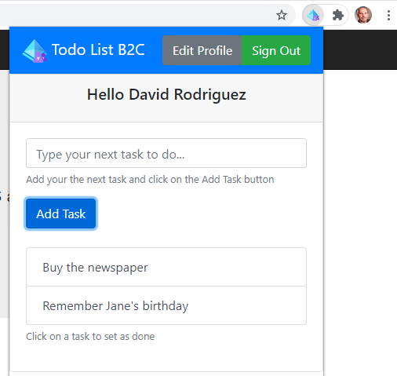
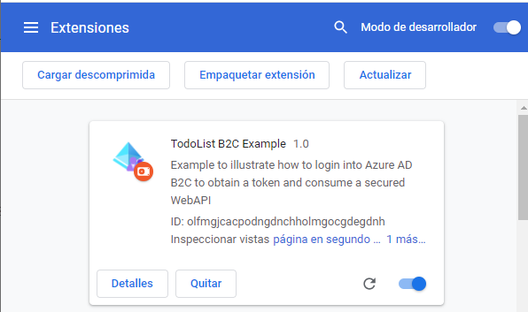
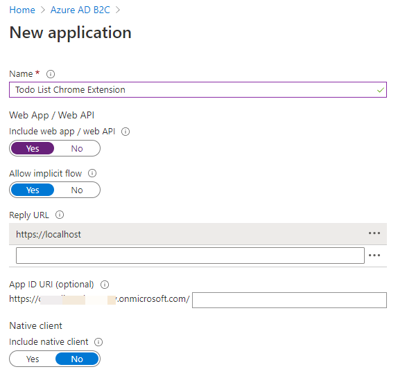
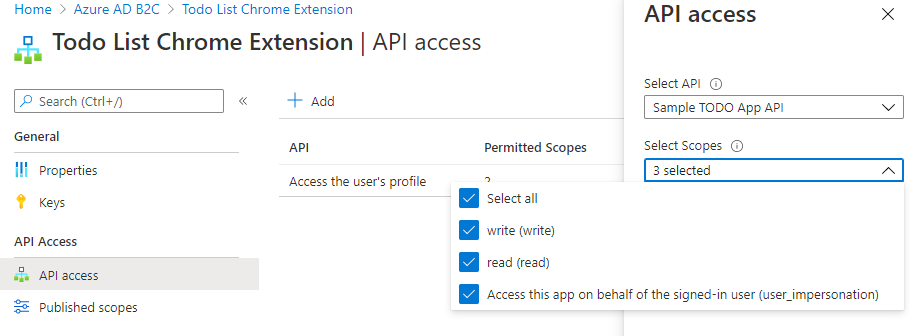
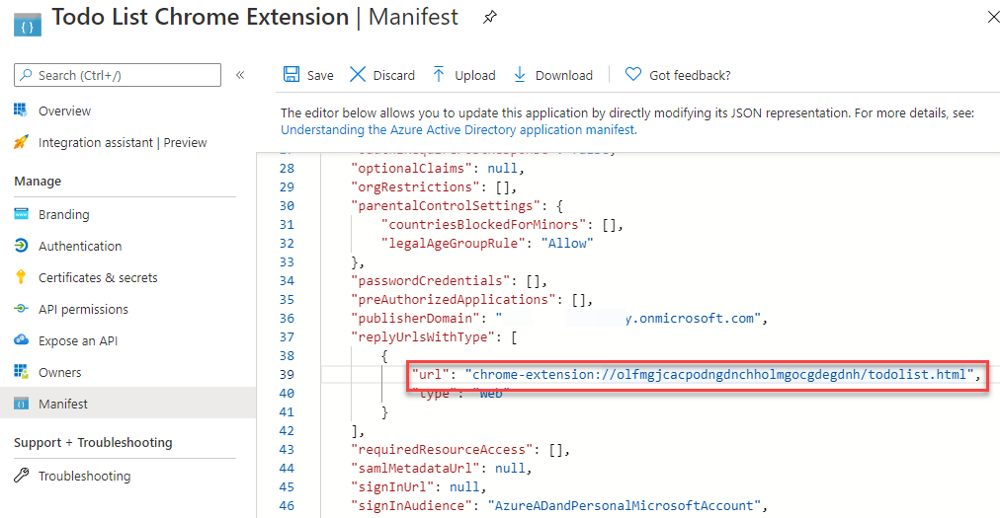

# Chrome Extension example using MSAL.js and Azure AD B2C

## Introduction
This is a Chrome Extension that can be used as example template demostrating how to consume an external WebAPI secured with Azure AD B2C. The example illustrates the the Todo List example as a SPA application embedded in a Chrome extension with MSAL.js login implementation, by adapting the original example provided by Microsoft at https://github.com/Azure-Samples/active-directory-b2c-javascript-msal-singlepageapp/tree/master/JavaScriptSPA

## Testing the Chrome Extension in Developer Mode

Follow these steps to setup the Chrome Extension:
1. Follow the instructions described at https://github.com/intelequia/dnn.azureadb2cprovider/tree/master/samples/active-directory-b2c-dotnet-webapp-and-webapi to setup the TodoList Service (WebAPI)
2. Download the Chrome extension code available on the "/src" folder
3. Open the Chrome extension settings [chrome://extensions](chrome://extensions)
4. Enable the "developer mode" by changing the slider on the top-right area of the screen
5. Click on the button "Load uncompressed" extension and select the folder
6. Copy the Chrome extension Id that appears on the extension details to a notepad
   
7. Go to the Azure Portal and select the B2C tenant that was used to setup the WebAPI on step #1 on https://portal.azure.com/#blade/Microsoft_AAD_B2CAdmin/TenantManagementMenuBlade/manageApplications
8. Add a new Application Registration:
   1. Set a new name for the application (i.e. "Todo List Chrome Extension")
   2. Enable the **Include WebApp/WebAPI** checkbox
   3. Enable the **Allow implicit flow** checkbox
   4. Set the reply URL to "https://localhost". We will be changing this value on steps below
   5. Leave the optioanl APP ID URL empty
   6. Don't enable the Native Client and click on the Create button
   
   7. Copy the Application ID to a notepad, you will be using this value later
   8. On the API Access section of the application click on "Add" and select the WebAPI scoes read and write you created on step #1
   
9.  Now we need to change the reply URL https://localhost for chrome-extension://{ChromeExtensionId}/todolist.html, but you can't do this through the application management UI, you need to directly edit the manifest. To change this:
       1.  Go to the Azure AD App registrations section at https://portal.azure.com/#blade/Microsoft_AAD_IAM/ActiveDirectoryMenuBlade/RegisteredApps (using the regular Azure AD management, not the B2C) and locate the application you created on step #8
       2.  On the Manifest section of the application, edit the manifest chaning the "replyUrlsWithType" section, replacing "https://localhost" for "chrome-extension://{ChromeExtensionId}/todolist.html", where {ChromeExtensionId} is the value you copied on step #6, and click on Save
       
10. Edit the files apiConfig.js to specify the scope names and endpoint of the WebAPI you created on step #1
11. Edit the file policies.js to specify the policy names and authorities
12. Edit background.js to indicate on which websites you want to enable the extension (or change the logic for what's better for you)
13. Finally edit the file authConfig.js and specify the Application ID you copied on step #8.7
14. Reload the extension on Chrome

# References
* https://github.com/Azure-Samples/active-directory-b2c-javascript-msal-singlepageapp/tree/master/JavaScriptSPA
   
