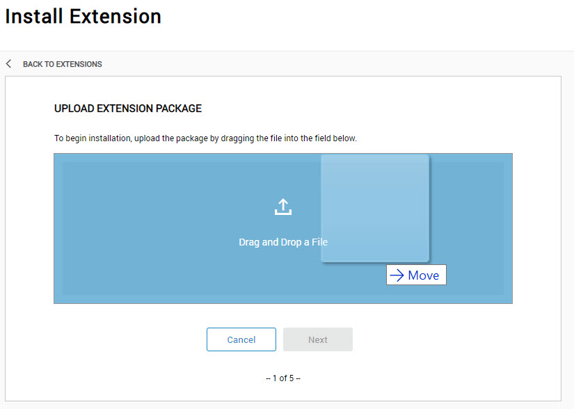
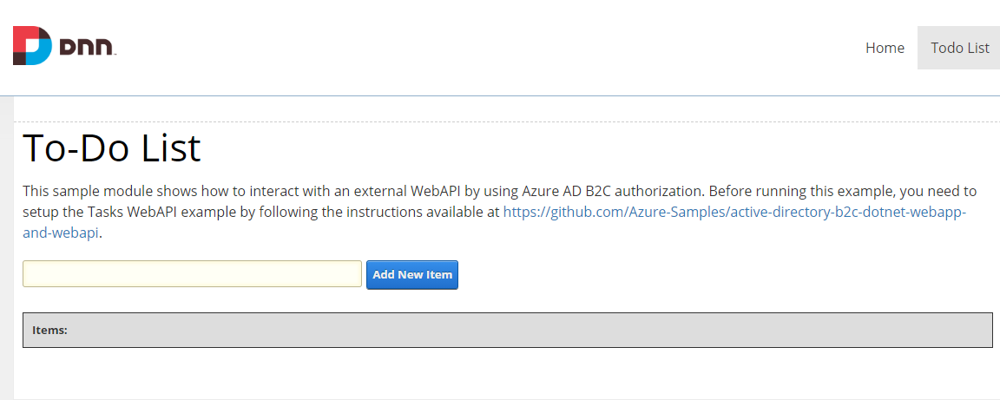
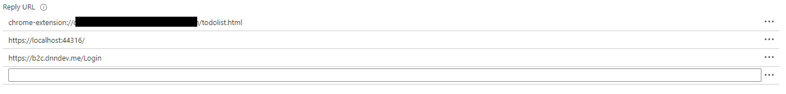


# SPA-WebAPI-Client

This sample contains a solution file with a project called ```SPA-WebAPI-Client```.
- ```SPA-WebAPI-Client``` is a "To-Do" DotNetNuke Module where users enters or updates their to-do items.These CRUD operations are performed by a backend web API.


## Getting Started

These instructions will get you a copy of the project up and running on your dnn platform for development and testing purposes.

### Prerequisites

- Visual Studio
- DNN Platform 9.3.0 or later ([see the official documentation](http://www.dnnsoftware.com/docs/administrators/setup/index.html))
- DNN Azure Active Directory B2C provider installed (https://github.com/intelequia/dnn.azureadb2cprovider)
- TaskService from the WebApp + WebApi sample running locally ([https://github.com/intelequia/dnn.azureadb2cprovider/tree/master/samples/active-directory-b2c-dotnet-webapp-and-webapi](https://github.com/intelequia/dnn.azureadb2cprovider/tree/master/samples/active-directory-b2c-dotnet-webapp-and-webapi))
### Installing

##### Step 1: Clone or download this repository
From your shell or command line:
```
git clone https://github.com/intelequia/dnn.azureadb2cprovider
```

##### Step 2: Open it on Visual Studio
The solution file is under the next path:
```
dnn.azureadb2cprovider/samples/SPA-WebAPI-Client/
```
##### Step 3: Building the solution
To generate the module install package we have to build the project in release mode. That will generate a install zip package under the install folder :
```dnn.azureadb2cprovider/samples/SPA-WebAPI-Client/install```

##### Step 4: Install the module 
To generate the module install package we have to build the project in release mode. That will generate a install zip package under the install folder :
```dnn.azureadb2cprovider/samples/SPA-WebAPI-Client/install```



##### Step 5:  Testing the module
Now, if you have the WebApi running locally (https://localhost:44332), and you place the module on the DNN page, you will see the following image:


If everything is working properly, we could add and delete ¨To-Do¨ items to the list.

## How to make Single Sign On (SSO) between all the samples
With this guide we want to have all the samples (webapp , dnn and chrome extension) with single-sign-on (SSO)

### Prerequisites

- Visual Studio
- WebApp + WebApi sample running locally ([https://github.com/intelequia/dnn.azureadb2cprovider/tree/master/samples/active-directory-b2c-dotnet-webapp-and-webapi](https://github.com/intelequia/dnn.azureadb2cprovider/tree/master/samples/active-directory-b2c-dotnet-webapp-and-webapi))

### Setup

##### Step 1: Register an application in Azure Active Directory B2C
In this step, We will create a b2c application or reuse one of the ones we have created in the previous examples
To create a b2c application follow this documentation [Register a web application in Azure Active Directory B2C](https://docs.microsoft.com/en-us/azure/active-directory-b2c/tutorial-register-applications?tabs=app-reg-ga))

##### Step 2:  Configure your samples with your Azure AD B2C app registration
Now that we have our b2c application, we have to configure all the samples, except the API, with this b2c application. 

To achieve this, we will setup all the samples following their respective instructions by just using one b2c application and don´t forget to add all your apps url to the Redirect Url at the B2C Application like this:


##### Step 3: Testing the SSO
If everything went as planned, we could now try log in to one of our applications, after logging in, we will try to login in another application, and this time it won't ask for credentials, it will enter directly with the account used in the other application